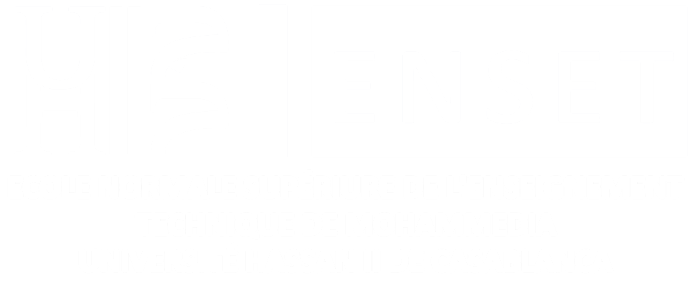
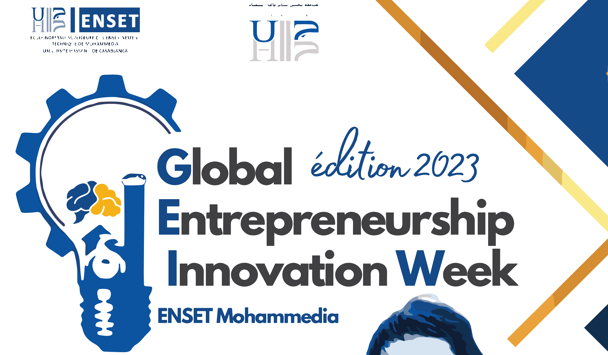
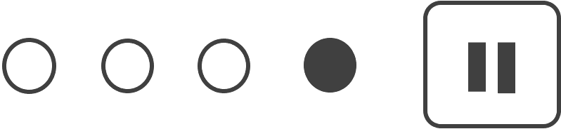
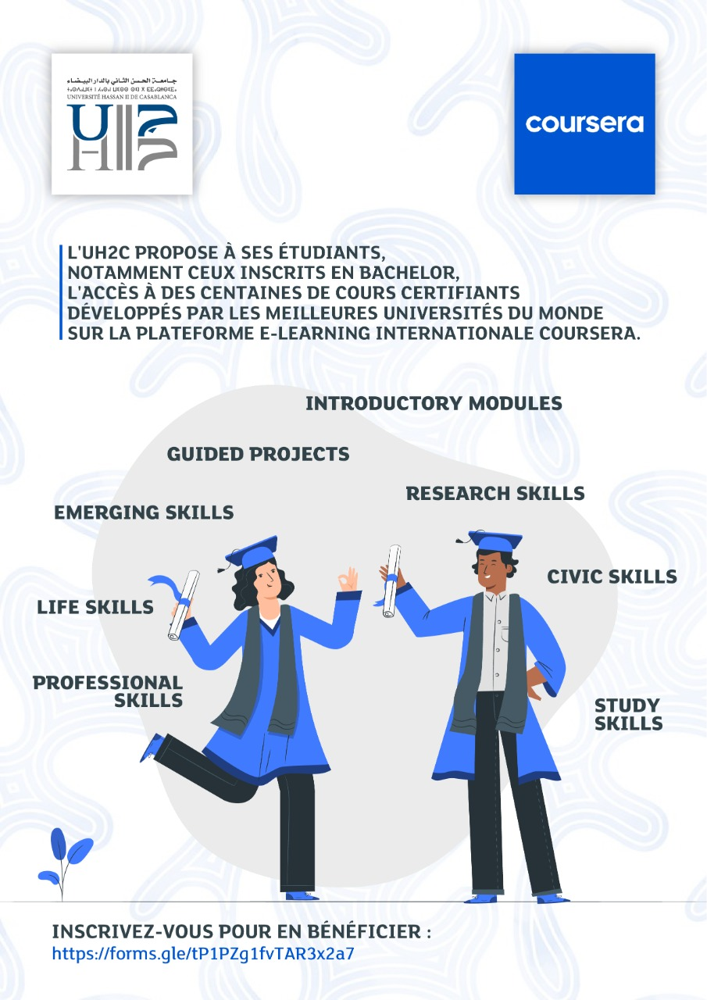
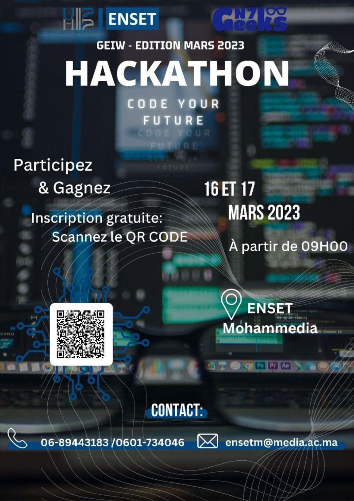

<!DOCTYPE html>
<html lang="en">

<head>
    <meta charset="UTF-8">
    <meta name="viewport" content="width=device-width, initial-scale=1.0">
    <title>ENSET Mohammedia | Ecole Normale Supérieure de l'Enseignement Technique</title>
    <link rel="shortcut icon" href="icon.png" type="image/x-icon">
    <link rel="stylesheet" href="style.css">
    <link rel="preconnect" href="https://fonts.googleapis.com">
    <link rel="preconnect" href="https://fonts.gstatic.com" crossorigin>
    <link href="https://fonts.googleapis.com/css2?family=Bowlby+One+SC&family=Croissant+One&family=Handjet:wght@300&family=Kablammo&family=Open+Sans:wght@300&family=Poppins:wght@100&family=Roboto+Mono:wght@100&family=Rubik:wght@600&family=Ysabeau+Office:ital@1&display=swap"
        rel="stylesheet">
    <link rel="preconnect" href="https://fonts.googleapis.com">
    <link rel="preconnect" href="https://fonts.gstatic.com" crossorigin>
    <link href="https://fonts.googleapis.com/css2?family=Source+Sans+3&display=swap" rel="stylesheet">
</head>

<body>
    

    

    

        
    

    

        <ul>
            <li>
                
            </li>
            <li>
                <a href="">Notre école</a>
            </li>
            <li>
                <a href="">Formation</a>
            </li>
            <li>
                <a href="">Rechereche</a>
            </li>
            <li>
                <a href="">Appels d'offres</a>
            </li>

        </ul>
    

    

        
        
        
        
    

    
 

    

        

            <input type="search" value="Rechercher ...">
            
        

        

            <a href="" style="text-decoration: underline;">FR</a>
            <a>|</a>
            <a href="">EN</a>
        

        

            <!-- <a href="">Accéder à mon espace</a> -->
            <a href="">ENT</a>
            
        

        

            <a href="">Entreprises/Partenaires</a>
            
        

    

    <main>
        

            
        

        

            
        

        

            
        

        

            
A LA UNE

            
Global Entrepreneurship Innovation Week

            
INNOVATION

            
L'ENSET Mohammedia organise l'édition 2023 de : Global Entrepreneurship Innovation Week Le 15 ,16 ,17 Mars 2023 à l'école.

            <button class="learn-more">
               
               
               
               LIRE LA SUITE
            </button>

            

                
            

        

    </main>
    <section>
        

            <button class="cta">
                 Toutes les actualités 
                <svg
                  id="arrow-horizontal"
                  xmlns="http://www.w3.org/2000/svg"
                  width="28"
                  height="8"
                  viewBox="0 0 46 16"
                >
                  <path
                    id="Path_10"
                    data-name="Path 10"
                    d="M8,0,6.545,1.455l5.506,5.506H-30V9.039H12.052L6.545,14.545,8,16l8-8Z"
                    transform="translate(30)"
                  ></path>
                </svg>
              </button>

        

        

            
LES ACTUALITÉS

            

                

                    

                        
                    

                    

                        
SCOLARITÉ

                        
l’Université Hassan II de Casablanca propose à ses étudiants des centaines de cours certifiants et Guided projects sur la célèbre plateforme e-learning internationale “COURSERA”

                        
11 Novembre 2021 

                    

                

                

                    

                        
                    

                    

                        
EVÉNEMENT

                        
Passionné par le coding et le challenge, l'ENSET de Mohammedia, dans le cadre de ses journées de l'entrepreneuriat et de l'innovation, vous donne l'opportunité de participer au Hackathon édition 2023.

                        
2 Mars 2023 

                    

                

            

        

    </section>

    <footer>
        

            
        

        

            
Ecole Normale Supérieure de l'Enseignement Technique    BP 159 Bd Hassan II Mohammedia

            
Tél : +212 (0)5 23 32 22 20

        

        

            <button class="ntaalm"> Contacts
            </button>
        

    </footer>
</body>

</html>
